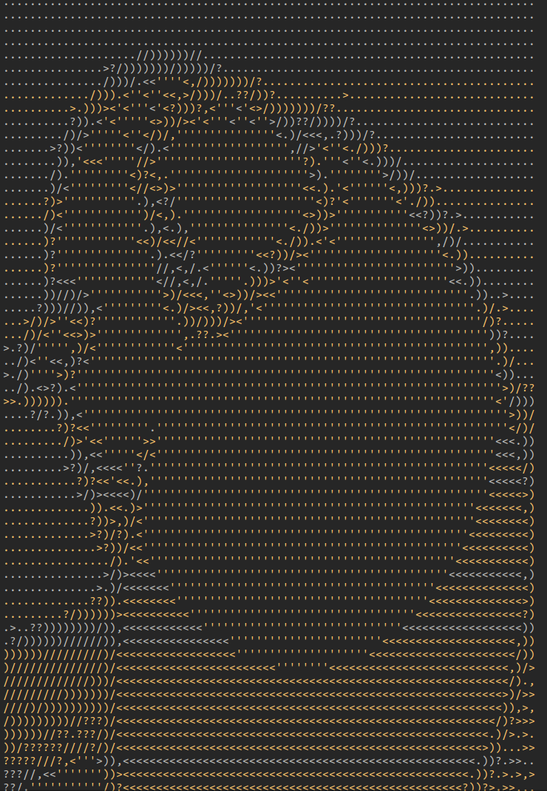

# Image to chars
## First you have to cloning the repository and install the dependencies:
```bash
git clone https://github.com/matin-ghorbani/image_to_chars.git
```
```bash
pip install requirements.txt
```
### The Imput Image

### The result of it


**At the end it gives you a text file.**
